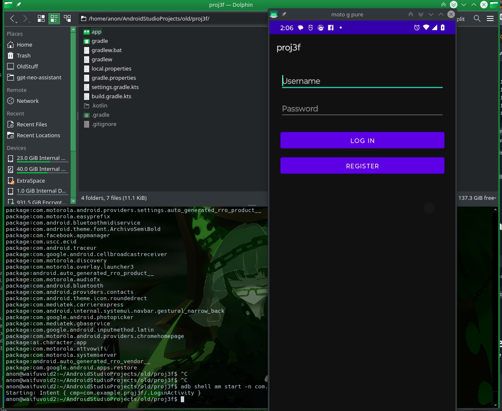
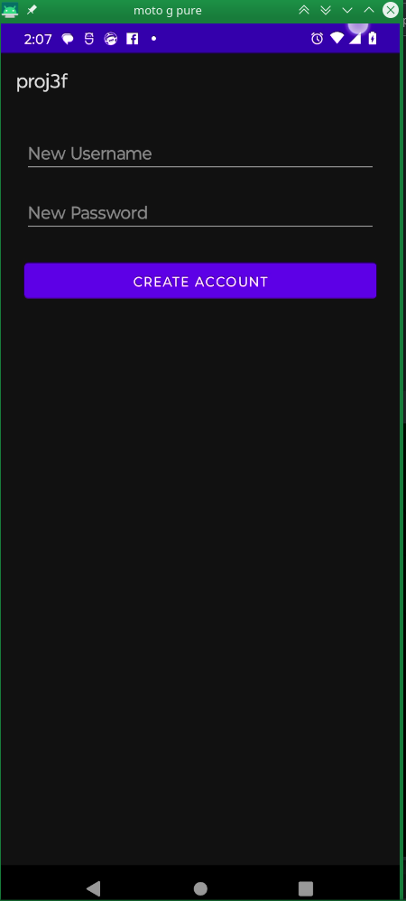
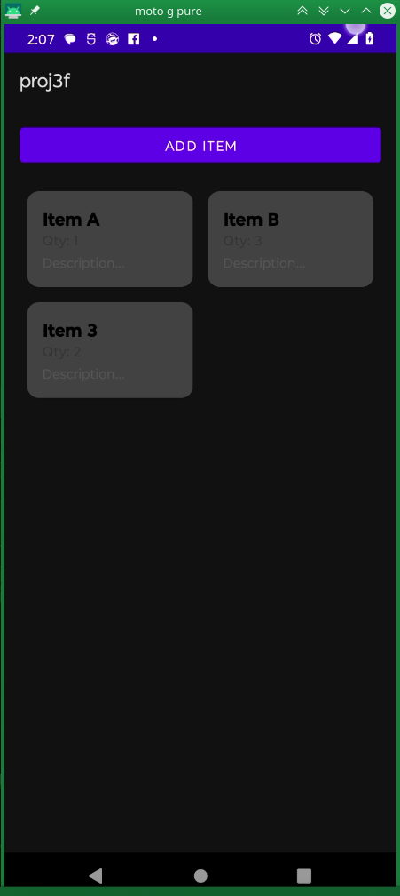
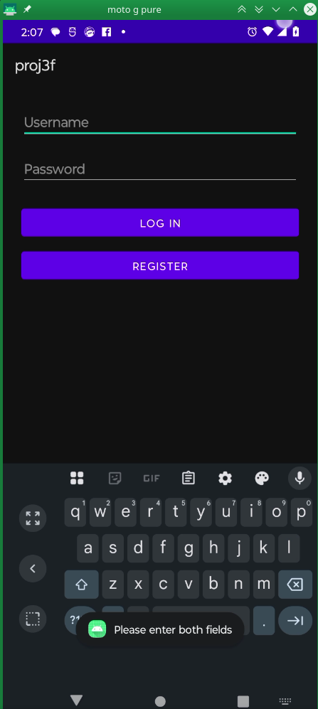
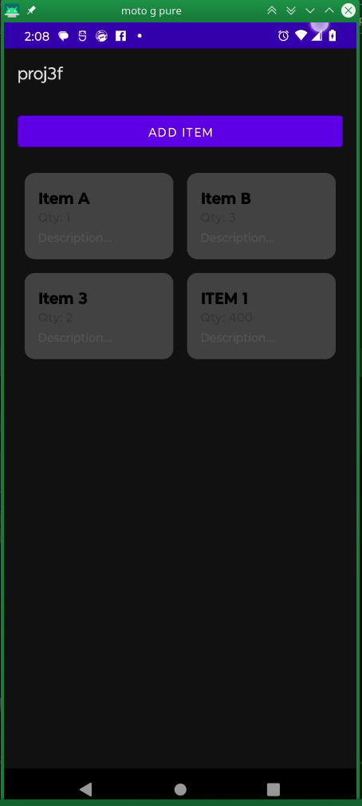

# 📦 Mobile Application - Inventory Tracker

## Overview
The **Inventory Tracker** mobile application was developed for the CS360 Mobile App Development course to demonstrate proficiency in mobile application design and coding principles.  
It is intended for submission to my professional portfolio, showcasing my ability to implement **user-centered design**, **mobile best practices**, and **responsive UI development** across Android devices.

---

## Requirements and Goals
The main goal of this application was to create a mobile tool that allows users to **manage and track inventory items** efficiently.  
This app addresses user needs such as:
- Quickly adding, editing, and deleting inventory items.
- Viewing a detailed list of current inventory.
- Managing item quantities, names, and descriptions through a user-friendly interface.

The app was designed to help users stay organized and to provide an intuitive mobile experience for inventory management.

---

## Screens and Features
To support user needs and ensure a user-centered design, the app includes:
- **Home Screen:** Displays a list of all inventory items.
- **Add/Edit Item Screen:** Allows users to input or modify item details.
- **Settings Screen:** (Future expansion) for customizing app preferences.

**Design decisions focused on:**
- Using **ConstraintLayout** for flexible and adaptive UI across various screen sizes.
- Simplifying navigation for quick access to key features.
- Following **Material Design guidelines** to maintain consistency and usability.

These designs were successful because they minimized user friction, provided clear affordances (buttons, input fields), and optimized visual hierarchy for ease of use.

---

## Coding Approach and Strategies
I approached the coding phase by following an **iterative development process**:
- Built core functionality first (adding and listing items).
- Layered UI refinement and interaction handling.
- Modularized code into clean components (Activity classes, helper functions).

**Key strategies included:**
- Applying the **Model-View-ViewModel (MVVM)** architecture to separate concerns and improve maintainability.
- Utilizing **ConstraintLayout** for scalable UI design.
- Preparing for data persistence (future enhancement using **Room Database**).

These strategies provide a solid, scalable foundation that will benefit future projects by making apps easier to maintain, test, and expand.

---

## Testing and Validation
Testing included:
- **Manual user testing** on both the Android emulator and a physical Pixel 6a device.
- **Lifecycle event testing** to verify stability across screen rotations (`onCreate`, `onPause`, `onResume`).
- **UI validation** for consistency in light and dark themes.
- **Logcat debugging** to monitor runtime behavior and ensure smooth navigation.

Testing is crucial to ensure functionality, detect UI inconsistencies, and catch early crashes. This process revealed minor layout issues, which were corrected through iterative improvement.

---

## Innovations and Challenges

| Challenge | Solution |
|:---|:---|
| Ensuring UI responsiveness across different screen sizes | Used `ConstraintLayout` and appropriate `dp/sp` units for scalable layouts |
| Managing app state across configuration changes | Leveraged **ViewModel** and `onSaveInstanceState` for data persistence |
| Preventing UI freezing during data operations | Integrated **Kotlin coroutines** for background processing |

---

## Demonstration of Knowledge, Skills, and Experience
The most successful component where I demonstrated my technical skills was the **dynamic inventory list management**:
- Created a reusable and flexible list adapter to display inventory items.
- Successfully managed lifecycle state across user interactions.
- Built a fully functional user interface that adheres to Android design best practices.

This project highlights my abilities in mobile app architecture, UI design, lifecycle management, and strategic testing.

---

## Repository Structure

- app/
  - src/
    - main/
      - java/
        - com/
          - example/
            - inventorytracker/   # Source code
      - res/                      # Layouts, drawables, values
      - AndroidManifest.xml
  - build.gradle
- README.md
- proj3f_final.zip                # Completed app code + UI designs

---

## How to Run
1. Clone the repository.
2. Open the project in **Android Studio Electric Eel (or later)**.
3. Build the project and run it on an Android emulator or a physical Android device.

---

## Link to Repository
>[ [https://github.com/synthesoul/CS360]]
---

## 📸 Screenshots

### Login Screen

### New User Registration Screen

### Home Screen (Inventory List)

### Add Item Feedback (Validation Check)

### Home Screen (More Inventory Items)

